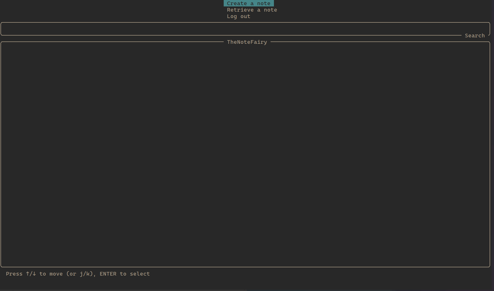

# TheNoteFairy

A multi-user TUI(text/terminal user interface) to take notes with vim-like keybindings from scratch using [curses](https://docs.python.org/3/library/curses.html#module-curses).

## CAPABILITIES
- Create and retrieve notes with different isolated users.
- Search notes for date and text.

---

> main menu displayed in alacritty terminal

> retrieving a note

## KNOWN PROBLEMS
- application MAY crash with small terminal size -> recommended big-size window
- application doesn't FULLY support resizing the terminal
- when searching for 2º time, you are searching at the previous results not at all notes
