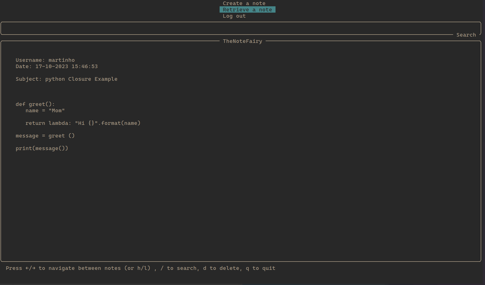
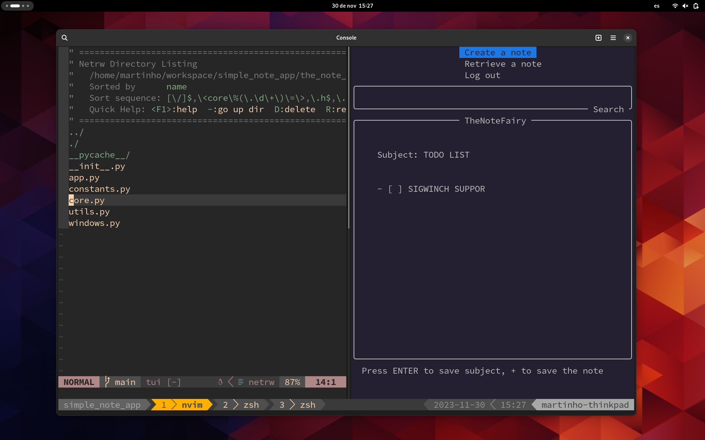
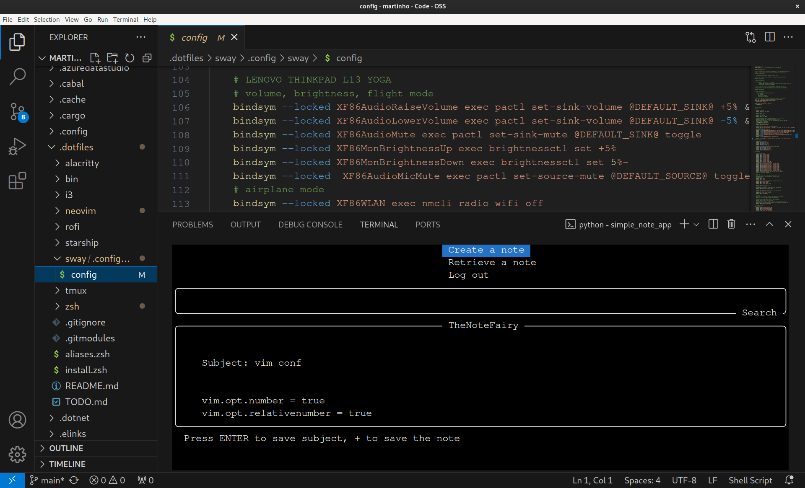

# TheNoteFairy

A multi-user TUI(text/terminal user interface) to take notes/snippets with vim-like keybindings from scratch using [curses](https://docs.python.org/3/library/curses.html#module-curses).

## INSTALLATION
- Clone the repository
'''
git clone git@github.com:martimolanes/TheNoteFairy.git
'''

- Install the requirements
'''
pip install -r requirements.txt
'''

- Run the application
'''
python the_note_fairy/the_note_fairy.py
'''

## CAPABILITIES
- Create, Retrieve and Delete notes with different isolated users.
- Search notes for date, subject or content.
- Fetch the title of the webpage stored.
- All notes and users are stored in a sqlite3 database.
- Users passwords are encrypted.

---

> retrieving a note

> Normal workflow with tmux and vim

> Opening TheNoteFairy with VSCode terminal

## KNOWN PROBLEMS
- application doesn't FULLY support resizing the terminal
- application MAY crash with small terminal size -> recommended big-size window
